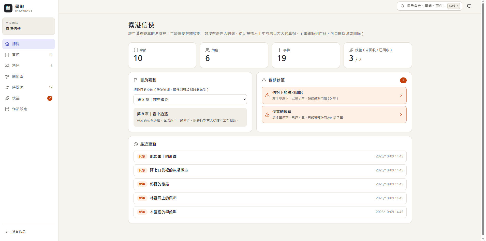
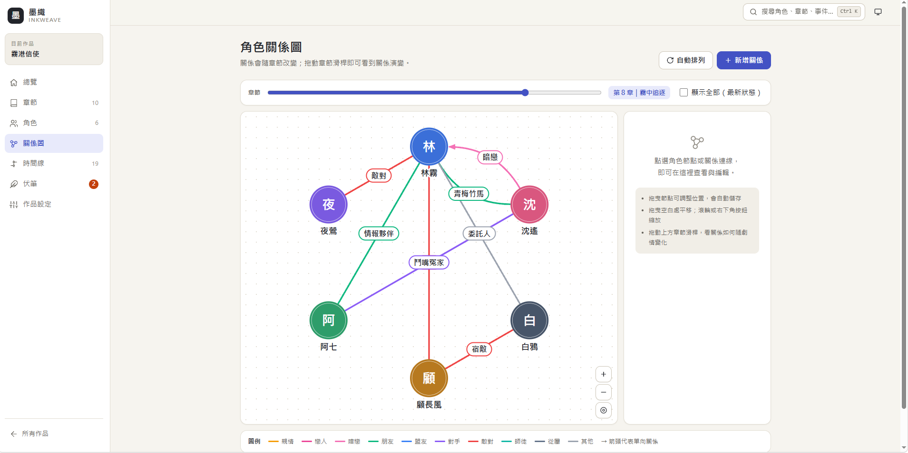
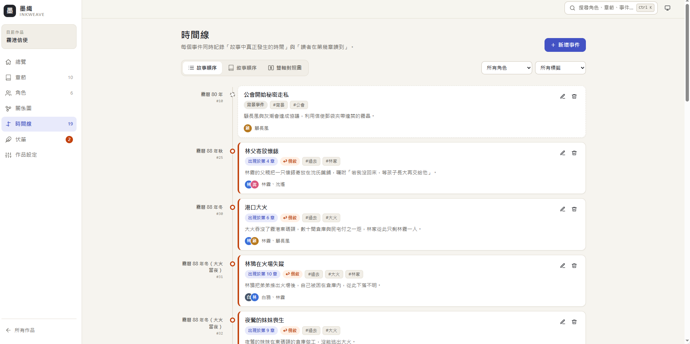
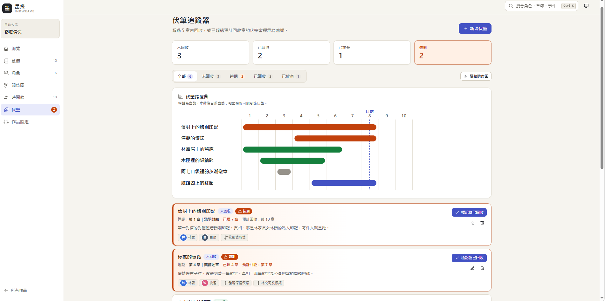

# 墨滴 InkWeave — 小說設定工坊

給小說寫作者的設定管理工具：以「章節」為骨架，把**角色、角色關係、時間線與伏筆**串在一起，讓你寫長篇時隨時掌握故事全貌。

不需註冊，打開就能用；資料存在你自己的瀏覽器中。

🔗 **線上網站：** https://tsan0428.github.io/INKWEAVE/

## 介面截圖

| 作品總覽 | 角色關係圖 |
|---|---|
|  |  |
| **時間線** | **伏筆追蹤器** |
|  |  |

## 功能

- **章節管理**：只記錄標題與摘要（不寫正文），可上移／下移或拖曳排序，展開即可看到本章的事件與伏筆。
- **角色卡**：外貌、性格、口頭禪、動機、秘密（模糊遮罩，點擊才顯示）、自訂欄位、頭像上傳（自動壓縮）；停止輸入 0.6 秒後自動儲存。角色卡下方會自動列出人際關係、參與事件、相關伏筆與出場章節。
- **角色關係圖**：SVG 繪製，可拖曳節點、縮放平移；拖動**章節滑桿**即可看到關係如何隨劇情改變（例如從「師徒」變成「敵對」）。
- **時間線**：每個事件同時記錄「故事中真正發生的時間」與「讀者在第幾章讀到」，可切換故事順序、敘事順序與雙軸對照圖，並自動標示「↩ 倒敘」。
- **伏筆追蹤器**：記錄埋設章與回收章，超過設定章數仍未回收的伏筆會自動標示為逾期；附伏筆跨度圖。
- **其他**：全域搜尋（Ctrl / ⌘ + K）、深色模式（淺色／深色／跟隨系統）、匯出／匯入 JSON 備份、一鍵載入範例作品《霧港信使》。

## 使用方式

1. 直接開啟上方的線上網址；或下載 `index.html`，用瀏覽器雙擊開啟即可。
2. 第一次使用可點「**載入範例作品**」，體驗所有功能。
3. 開發者可在網址後加上 `?selftest`，於主控台執行核心計算邏輯的自我檢查。

## 資料儲存

- 所有資料都存在**此瀏覽器的 IndexedDB** 中，不會上傳到任何伺服器。
- 清除瀏覽器資料、或換一台電腦／瀏覽器，資料就不會跟著過去，**請定期使用「匯出」備份**。
- 備份檔（JSON）可在任何瀏覽器的墨滴中「匯入」，匯入時一律建立新副本，不會覆蓋既有資料。

## 技術

- 單一 `index.html`：CSS 與 JavaScript 皆寫在檔案內，不使用任何外部函式庫、字型或圖片。
- 原生 JavaScript（ES2020+）、IndexedDB、SVG、Canvas（頭像壓縮）。
- 以 GitHub Pages 發布。

## 關於本專案

本專案以 **AI 輔助開發（Vibe Coding）** 完成：先與 AI 討論想法並整理出規格書，再依規格書分里程碑請 AI 實作、逐項驗收與修正。

完整規格書（功能、資料結構、計算邏輯、里程碑、驗收清單與 AI 協作紀錄）請見 [SPEC.md](SPEC.md)。
